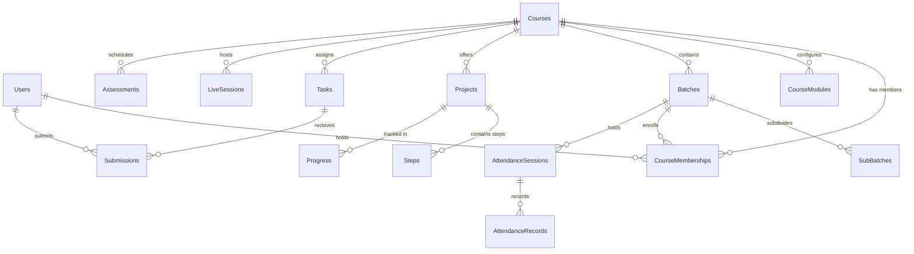

# 🗄️ Database Schema Specification — Multi-Course Project LMS

**Date:** September 2026  
**Status:** Schema Specification  
**Database:** TiDB Cloud MySQL 8.0-compatible

---

## 1. New Core Tables

### 1.1 `Courses` Table
Primary domain entity representing each curriculum/track.

```sql
CREATE TABLE IF NOT EXISTS Courses (
    id INT AUTO_INCREMENT PRIMARY KEY,
    name VARCHAR(255) NOT NULL,
    code VARCHAR(50) NOT NULL UNIQUE,              -- e.g. 'GENAI-FS', 'JAVA-FS'
    slug VARCHAR(100) NOT NULL UNIQUE,             -- e.g. 'agentk', 'javafs'
    description TEXT,
    short_name VARCHAR(50),
    status ENUM('active', 'inactive', 'draft') DEFAULT 'active',
    logo_url VARCHAR(500),
    thumbnail_url VARCHAR(500),
    duration VARCHAR(100),                         -- e.g. '6 Months'
    created_by INT NULL,
    created_at TIMESTAMP DEFAULT CURRENT_TIMESTAMP,
    updated_at TIMESTAMP DEFAULT CURRENT_TIMESTAMP ON UPDATE CURRENT_TIMESTAMP,
    FOREIGN KEY (created_by) REFERENCES Users(id) ON DELETE SET NULL,
    INDEX idx_courses_slug (slug),
    INDEX idx_courses_status (status)
) ENGINE=InnoDB DEFAULT CHARSET=utf8mb4;
```

---

### 1.2 `CourseMemberships` Table
Represents a user's multi-course role assignment and batch association. A single global user can hold memberships across multiple courses (e.g. Student in Course A, Faculty in Course B).

```sql
CREATE TABLE IF NOT EXISTS CourseMemberships (
    id INT AUTO_INCREMENT PRIMARY KEY,
    user_id INT NOT NULL,
    course_id INT NOT NULL,
    role ENUM('student', 'faculty', 'coordinator', 'admin') NOT NULL,
    batch_id INT NULL,                             -- Primary batch in this course (for students)
    status ENUM('active', 'inactive', 'completed', 'dropped') DEFAULT 'active',
    enrolled_at TIMESTAMP DEFAULT CURRENT_TIMESTAMP,
    completed_at TIMESTAMP NULL,
    created_at TIMESTAMP DEFAULT CURRENT_TIMESTAMP,
    updated_at TIMESTAMP DEFAULT CURRENT_TIMESTAMP ON UPDATE CURRENT_TIMESTAMP,
    FOREIGN KEY (user_id) REFERENCES Users(id) ON DELETE CASCADE,
    FOREIGN KEY (course_id) REFERENCES Courses(id) ON DELETE CASCADE,
    FOREIGN KEY (batch_id) REFERENCES Batches(id) ON DELETE SET NULL,
    UNIQUE KEY unique_user_course_role (user_id, course_id, role),
    INDEX idx_membership_user (user_id),
    INDEX idx_membership_course_role (course_id, role),
    INDEX idx_membership_status (status)
) ENGINE=InnoDB DEFAULT CHARSET=utf8mb4;
```

---

### 1.3 `CourseModules` Table
Provides module-level toggle configuration per course (e.g. enable/disable Mock Interviews or Projects).

```sql
CREATE TABLE IF NOT EXISTS CourseModules (
    id INT AUTO_INCREMENT PRIMARY KEY,
    course_id INT NOT NULL,
    module_key VARCHAR(50) NOT NULL,              -- 'projects', 'tasks', 'attendance', 'mock_interviews', 'academics', 'resumes'
    is_enabled BOOLEAN DEFAULT TRUE,
    settings JSON NULL,                            -- Course-specific module settings
    created_at TIMESTAMP DEFAULT CURRENT_TIMESTAMP,
    updated_at TIMESTAMP DEFAULT CURRENT_TIMESTAMP ON UPDATE CURRENT_TIMESTAMP,
    FOREIGN KEY (course_id) REFERENCES Courses(id) ON DELETE CASCADE,
    UNIQUE KEY unique_course_module (course_id, module_key)
) ENGINE=InnoDB DEFAULT CHARSET=utf8mb4;
```

---

## 2. Alterations to Existing Tables

### 2.1 `Projects` Table
Add direct course scoping.
```sql
ALTER TABLE Projects 
ADD COLUMN course_id INT NULL AFTER id;

ALTER TABLE Projects 
ADD CONSTRAINT fk_projects_course 
FOREIGN KEY (course_id) REFERENCES Courses(id) ON DELETE RESTRICT;

CREATE INDEX idx_projects_course_level ON Projects(course_id, level, order_index);
```

### 2.2 `Batches` Table
Associate batches directly with a course.
```sql
ALTER TABLE Batches 
ADD COLUMN course_id INT NULL AFTER id;

ALTER TABLE Batches 
ADD CONSTRAINT fk_batches_course 
FOREIGN KEY (course_id) REFERENCES Courses(id) ON DELETE RESTRICT;

CREATE INDEX idx_batches_course ON Batches(course_id);
```

### 2.3 `Tasks` Table
Add direct course scoping for fast query isolation and coordinator authorization.
```sql
ALTER TABLE Tasks 
ADD COLUMN course_id INT NULL AFTER id;

ALTER TABLE Tasks 
ADD CONSTRAINT fk_tasks_course 
FOREIGN KEY (course_id) REFERENCES Courses(id) ON DELETE CASCADE;

CREATE INDEX idx_tasks_course ON Tasks(course_id);
```

### 2.4 `Assessments` Table
Add course scoping to curriculum assessments.
```sql
ALTER TABLE Assessments 
ADD COLUMN course_id INT NULL AFTER id;

ALTER TABLE Assessments 
ADD CONSTRAINT fk_assessments_course 
FOREIGN KEY (course_id) REFERENCES Courses(id) ON DELETE CASCADE;

CREATE INDEX idx_assessments_course ON Assessments(course_id);
```

### 2.5 `LiveSessions` Table
Add course scoping to live classes, mock interviews, and mentoring sessions.
```sql
ALTER TABLE LiveSessions 
ADD COLUMN course_id INT NULL AFTER id;

ALTER TABLE LiveSessions 
ADD CONSTRAINT fk_livesessions_course 
FOREIGN KEY (course_id) REFERENCES Courses(id) ON DELETE CASCADE;

CREATE INDEX idx_livesessions_course ON LiveSessions(course_id);
```

### 2.6 `Users` Table — Role Enhancement
Add `super_admin` to the global `role` enum.
```sql
ALTER TABLE Users 
MODIFY COLUMN role ENUM('student', 'admin', 'coordinator', 'faculty', 'super_admin') DEFAULT 'student';
```

---

## 3. Entity Relationship Diagram (Target)



---

## 4. Constraint & Integrity Checklist

| Entity | Constraint | Description |
| :--- | :--- | :--- |
| `Courses.slug` | `UNIQUE` | Guarantees deterministic, conflict-free URL routing. |
| `Courses.code` | `UNIQUE` | Guarantees standard administrative course code identification. |
| `CourseMemberships` | `UNIQUE(user_id, course_id, role)` | A user cannot hold duplicate identical roles in the same course. |
| `Projects.course_id` | `NOT NULL` (Post-Migration) | Ensures no orphan projects exist outside a course curriculum. |
| `Batches.course_id` | `NOT NULL` (Post-Migration) | Ensures every batch belongs strictly to one course curriculum. |
| Foreign Key `ON DELETE` | `RESTRICT` on Courses | Prevents accidental deletion of a course while batches or projects still reference it. |
