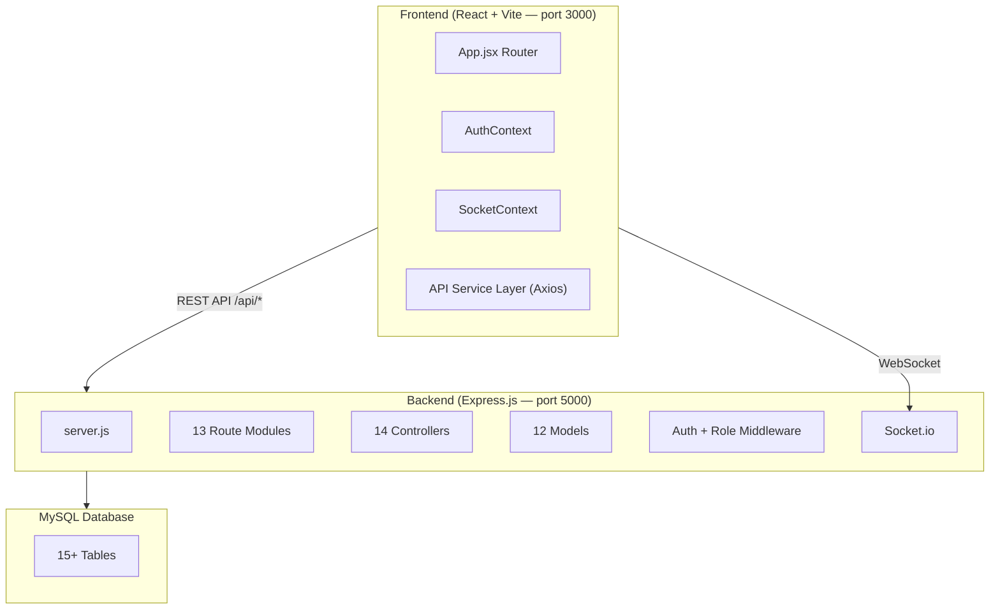
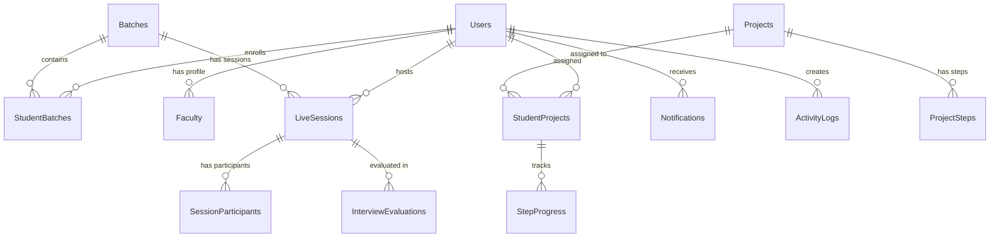

# 📚 Project Overview — Student Execution & Mentorship Platform (LMS)

A **full-stack Learning Management System** built with **React + Vite** (frontend) and **Node.js + Express + MySQL** (backend), featuring **4 user roles**, **real-time communication**, and **comprehensive academic management**.

---

## 🏗️ Architecture at a Glance

---

## 👥 Four User Roles & Their Dashboards

| Role | Dashboard | Key Capabilities |
|------|-----------|-----------------|
| **Admin** | [AdminDashboard.jsx](file:///c:/Users/kagit/Desktop/Project%20task/frontend/src/pages/AdminDashboard.jsx) | Full system control — user CRUD, batch management, analytics, system history, project management |
| **Coordinator** | [CoordinatorDashboard.jsx](file:///c:/Users/kagit/Desktop/Project%20task/frontend/src/pages/coordinator/CoordinatorDashboard.jsx) | Sub-batch management, task creation/review, attendance, academic operations, student progress approval |
| **Faculty** | [FacultyDashboard.jsx](file:///c:/Users/kagit/Desktop/Project%20task/frontend/src/pages/faculty/FacultyDashboard.jsx) | Student monitoring, mock interviews, academic guidance, performance tracking, mentoring sessions |
| **Student** | [Dashboard.jsx](file:///c:/Users/kagit/Desktop/Project%20task/frontend/src/pages/Dashboard.jsx) | Project learning, task submissions, attendance view, performance, live classroom, mock interviews |

---

## 🗂️ Complete Feature Map

### 1. Authentication & Authorization
- **JWT-based auth** with token stored in `localStorage`
- [authMiddleware.js](file:///c:/Users/kagit/Desktop/Project%20task/backend/middleware/authMiddleware.js) — Token verification (`protect`) + role authorization (`authorize`)
- [roles.js](file:///c:/Users/kagit/Desktop/Project%20task/backend/middleware/roles.js) — Granular RBAC with batch/session/project access checks, rate limiting, ownership validation
- [AuthContext.jsx](file:///c:/Users/kagit/Desktop/Project%20task/frontend/src/context/AuthContext.jsx) — React context for login/logout/user state
- Auto-redirect on 401 responses

### 2. Project-Based Learning System
- **Projects** with difficulty levels (beginner/intermediate/advanced) and steps
- **Two project types**: Simple (all steps unlocked) vs Main (sequential, coordinator-approved)
- Step-by-step guided learning with code snippets and explanations
- Step progress tracking: `not_started → in_progress → completed`
- Coordinator approval workflow for main projects
- File uploads via **Multer**

### 3. Batch & Student Management
- Batch creation with coordinator assignment
- Sub-batch management for coordinators
- Student enrollment with batch assignment
- Bulk student creation
- Performance score & attendance rate tracking per batch

### 4. Task Management System
- Coordinators create and assign tasks
- Students submit task responses
- Coordinator review with approve/reject workflow
- Submission history tracking

### 5. Attendance System
- Session-based attendance with topic tracking
- Mark attendance: `present / partial / absent`
- Attendance history with date-range filtering
- Student self-view of attendance summary
- Batch-level attendance reports

### 6. Live Classroom & Sessions
- Session types: `class / mock_interview / mentoring / meeting`
- Session scheduling with meeting links
- Participant tracking (join/leave times, duration)
- Session status workflow: `scheduled → live → ended`
- Recording URL support

### 7. Mock Interview System
- Faculty-scheduled mock interviews
- Multi-criteria evaluation (communication, technical, confidence, problem-solving)
- Detailed feedback: strengths, weaknesses, recommendations
- Score tracking and history

### 8. Academic Operations
- Class link management with bookmarks
- Assessment creation and result recording
- Academic overview with progress tracking
- Academic guidance features for faculty

### 9. Real-Time Messaging
- [MessagingInterface.jsx](file:///c:/Users/kagit/Desktop/Project%20task/frontend/src/components/messaging/MessagingInterface.jsx) — Rich messaging UI (62KB component!)
- Direct messages & batch announcements
- Message pinning, emoji reactions
- Unread count badges
- Socket.io-powered real-time delivery

### 10. Notification System
- Multi-type: `class_reminder / deadline / interview / feedback / alert / general`
- Priority levels: `low / medium / high / urgent`
- Real-time push via Socket.io
- [NotificationBell.jsx](file:///c:/Users/kagit/Desktop/Project%20task/frontend/src/components/notifications/NotificationBell.jsx) — Bell icon with live count
- Manual notification sending (admin/coordinator)

### 11. Analytics & Reporting
- [AdminAnalytics.jsx](file:///c:/Users/kagit/Desktop/Project%20task/frontend/src/pages/admin/AdminAnalytics.jsx) — Charts using **Recharts**
- Student performance metrics with risk-level indicators
- Dashboard statistics for all roles
- System activity history & audit logging

---

## 📁 Project Structure

### Backend — 13 API Route Modules

| Route Prefix | Route File | Controller | Purpose |
|---|---|---|---|
| `/api/auth` | [authRoutes.js](file:///c:/Users/kagit/Desktop/Project%20task/backend/routes/authRoutes.js) | [authController.js](file:///c:/Users/kagit/Desktop/Project%20task/backend/controllers/authController.js) | Login, Register, Get User |
| `/api/projects` | [projectRoutes.js](file:///c:/Users/kagit/Desktop/Project%20task/backend/routes/projectRoutes.js) | [projectController.js](file:///c:/Users/kagit/Desktop/Project%20task/backend/controllers/projectController.js) | CRUD, steps, resume learning |
| `/api/users` | [userRoutes.js](file:///c:/Users/kagit/Desktop/Project%20task/backend/routes/userRoutes.js) | [userController.js](file:///c:/Users/kagit/Desktop/Project%20task/backend/controllers/userController.js) | Profile, password, batch assignment |
| `/api/admin` | [adminRoutes.js](file:///c:/Users/kagit/Desktop/Project%20task/backend/routes/adminRoutes.js) | [adminController.js](file:///c:/Users/kagit/Desktop/Project%20task/backend/controllers/adminController.js) | User CRUD, batch CRUD, history |
| `/api/coordinator` | [coordinatorRoutes.js](file:///c:/Users/kagit/Desktop/Project%20task/backend/routes/coordinatorRoutes.js) | [coordinatorController.js](file:///c:/Users/kagit/Desktop/Project%20task/backend/controllers/coordinatorController.js) | Sub-batches, tasks, approvals |
| `/api/faculty` | [facultyRoutes.js](file:///c:/Users/kagit/Desktop/Project%20task/backend/routes/facultyRoutes.js) | [facultyController.js](file:///c:/Users/kagit/Desktop/Project%20task/backend/controllers/facultyController.js) | Interviews, monitoring, mentoring |
| `/api/student` | [studentRoutes.js](file:///c:/Users/kagit/Desktop/Project%20task/backend/routes/studentRoutes.js) | [studentController.js](file:///c:/Users/kagit/Desktop/Project%20task/backend/controllers/studentController.js) | Tasks, submissions |
| `/api/progress` | [progressRoutes.js](file:///c:/Users/kagit/Desktop/Project%20task/backend/routes/progressRoutes.js) | [progressController.js](file:///c:/Users/kagit/Desktop/Project%20task/backend/controllers/progressController.js) | Step progress, stats |
| `/api/academics` | [academicRoutes.js](file:///c:/Users/kagit/Desktop/Project%20task/backend/routes/academicRoutes.js) | [academicController.js](file:///c:/Users/kagit/Desktop/Project%20task/backend/controllers/academicController.js) | Class links, assessments, attendance |
| `/api/platform` | [platformRoutes.js](file:///c:/Users/kagit/Desktop/Project%20task/backend/routes/platformRoutes.js) | [platformController.js](file:///c:/Users/kagit/Desktop/Project%20task/backend/controllers/platformController.js) | Sessions, interviews, performance |
| `/api/attendance` | [attendanceRoutes.js](file:///c:/Users/kagit/Desktop/Project%20task/backend/routes/attendanceRoutes.js) | [attendanceController.js](file:///c:/Users/kagit/Desktop/Project%20task/backend/controllers/attendanceController.js) | Session attendance, history |
| `/api/messages` | [messageRoutes.js](file:///c:/Users/kagit/Desktop/Project%20task/backend/routes/messageRoutes.js) | [messageController.js](file:///c:/Users/kagit/Desktop/Project%20task/backend/controllers/messageController.js) | DM, announcements, reactions |
| `/api/notifications` | [notificationRoutes.js](file:///c:/Users/kagit/Desktop/Project%20task/backend/routes/notificationRoutes.js) | [notificationController.js](file:///c:/Users/kagit/Desktop/Project%20task/backend/controllers/notificationController.js) | CRUD, mark read, send manual |

### Frontend — Page & Component Breakdown

**Pages (36 total across 6 directories):**

| Area | Pages | Count |
|------|-------|-------|
| **Admin** | AdminDashboard, Analytics, Batches, Coordinators, Faculties, Projects, Students, Users, SystemHistory, Sessions | 10 |
| **Coordinator** | CoordinatorDashboard, AcademicOps, Attendance, Activity, SubBatches, Tasks, Submissions | 7 |
| **Faculty** | FacultyDashboard, AcademicGuidance, Projects, Sessions, Performance, StudentMonitoring | 6 |
| **Student** | Dashboard, ProjectLearning, GuidedLearning, MyProgress, Tasks, TaskSubmission, Attendance, AcademicProgress, ChangePassword | 9 |
| **Platform** | LiveClassroom, MockInterview, StudentPerformance, ProjectManager, SessionManager, NotificationCenter | 6 |
| **Shared** | Login, MessagingPage, StudentProfilePage | 3 |

**Reusable Components:**
- `common/` — Button, Card, ConfirmDialog, ProgressBar
- `layout/` — AdminLayout, CoordinatorLayout, FacultyLayout, StudentLayout, Sidebar
- `messaging/` — MessagingIcon, MessagingInterface
- `notifications/` — NotificationBell
- `learning/` — ResumeLearning
- `forms/` — ProjectUploadForm

---

## 🗃️ Database Schema — 15+ Tables

**Key Tables**: Users, Faculty, Batches, StudentBatches, Projects, ProjectSteps, StudentProjects, StepProgress, LiveSessions, SessionParticipants, InterviewEvaluations, StudentPerformance, Notifications, ActivityLogs, SystemSettings

---

## ⚙️ Tech Stack Summary

| Layer | Technology | Version |
|-------|-----------|---------|
| **Frontend Framework** | React | 18.2 |
| **Build Tool** | Vite | 4.1 |
| **Routing** | React Router DOM | 6.8 |
| **HTTP Client** | Axios | 1.3 |
| **Charts** | Recharts | 3.8 |
| **Icons** | Lucide React | 0.577 |
| **Real-time (client)** | socket.io-client | 4.8 |
| **Excel Export** | xlsx | 0.18 |
| **Backend Runtime** | Node.js | 16+ |
| **Web Framework** | Express.js | 4.18 |
| **Database Driver** | mysql2 | 3.22 |
| **Auth** | jsonwebtoken + bcryptjs | 9.0 / 2.4 |
| **File Upload** | Multer | 2.1 |
| **Real-time (server)** | Socket.io | 4.8 |
| **Database** | MySQL | — |
| **Dev Tool** | Nodemon | 3.0 |
| **Deployment Config** | Vercel (frontend) | — |

---

## 🔄 Core Workflow (from Flowchart)

**Student Flow:**
1. Login → Student Dashboard → View Assigned Projects
2. **Simple projects**: All steps unlocked → Read & build → Mark done → Complete
3. **Main projects**: View current step only → Build → Mark as completed (status = Pending) → Wait for coordinator review → Approved? → Unlock next step → Repeat → Project completed

**Coordinator Flow:**
1. Login → Dashboard → View students → Select student → View step progress
2. Pending step? → Review details → Approve (unlock next step) or Reject with feedback (student reworks)

**Admin Flow:**
1. Login → Admin Dashboard
2. **User Management**: Create students, coordinators, faculties
3. **Project Management**: Create projects, add steps (title, explanation, code snippet, order)

---

## 📊 Key Metrics

| Metric | Count |
|--------|-------|
| Backend Route Modules | 13 |
| Backend Controllers | 14 |
| Backend Models | 12 |
| Frontend Pages | ~36 |
| Frontend Components | ~15 |
| API Service Modules | 4 (api.js, platformAPI.js, facultyAPI.js, socketService.js) |
| Database Migration Files | 25 |
| Total Database Tables | 15+ |
| User Roles | 4 (admin, coordinator, faculty, student) |

---

## 🚀 Running Status

Both servers are currently running:
- **Frontend**: `npm run dev` on port **3000** (running 3h+)
- **Backend**: `npm run dev` on port **5000** (running 3h+)
- Vite proxy forwards `/api/*` requests from frontend to backend

---

> [!NOTE]
> This is a **mature, feature-rich LMS** with significant complexity. The codebase has evolved through **9+ database migration versions**, indicating active iterative development. The platform goes well beyond basic project learning — it's a complete **Student Execution & Mentorship Platform** with live classrooms, mock interviews, attendance tracking, real-time messaging, and multi-role analytics.
