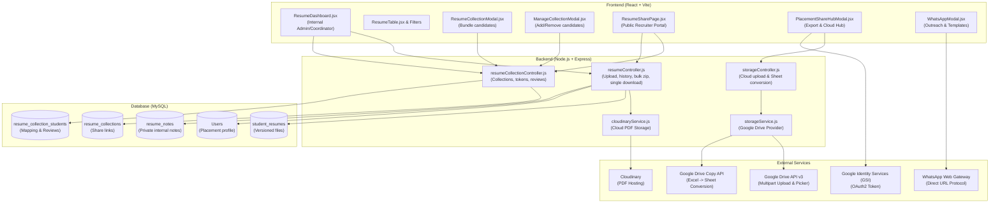
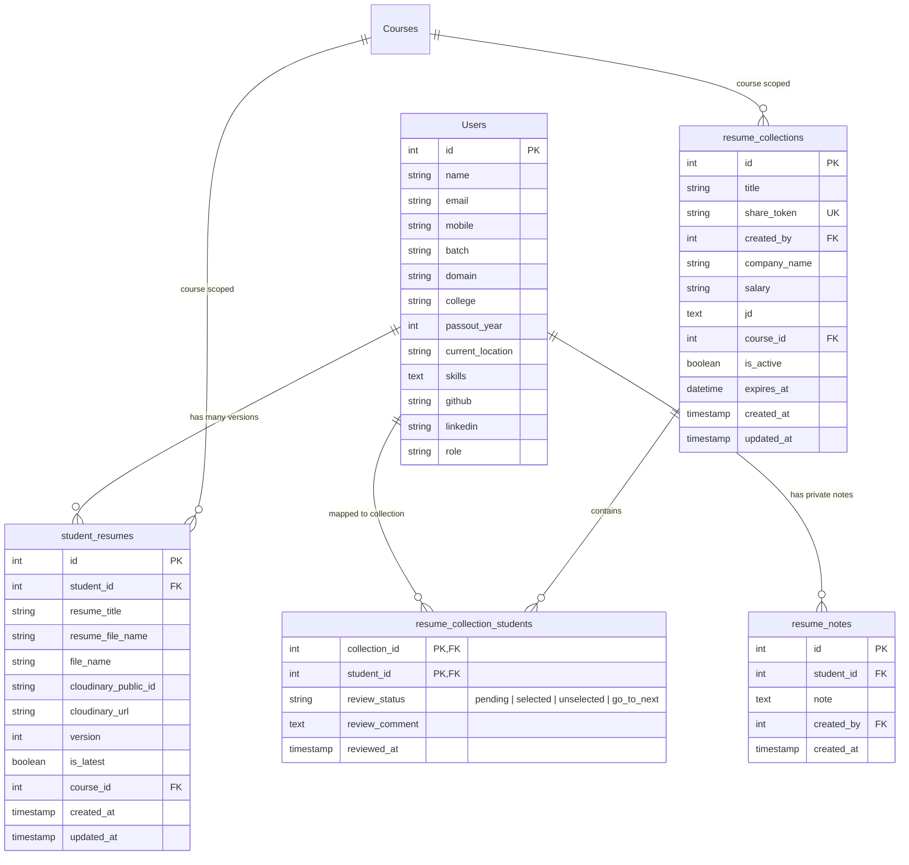
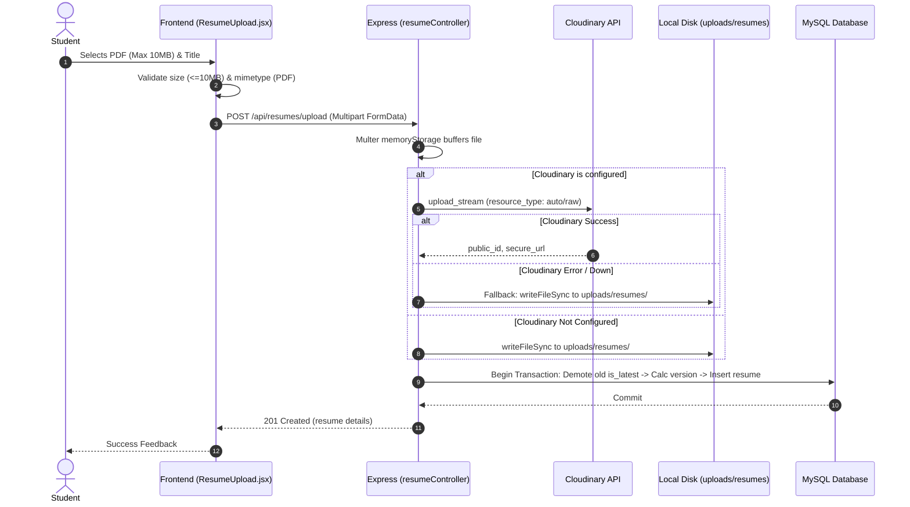
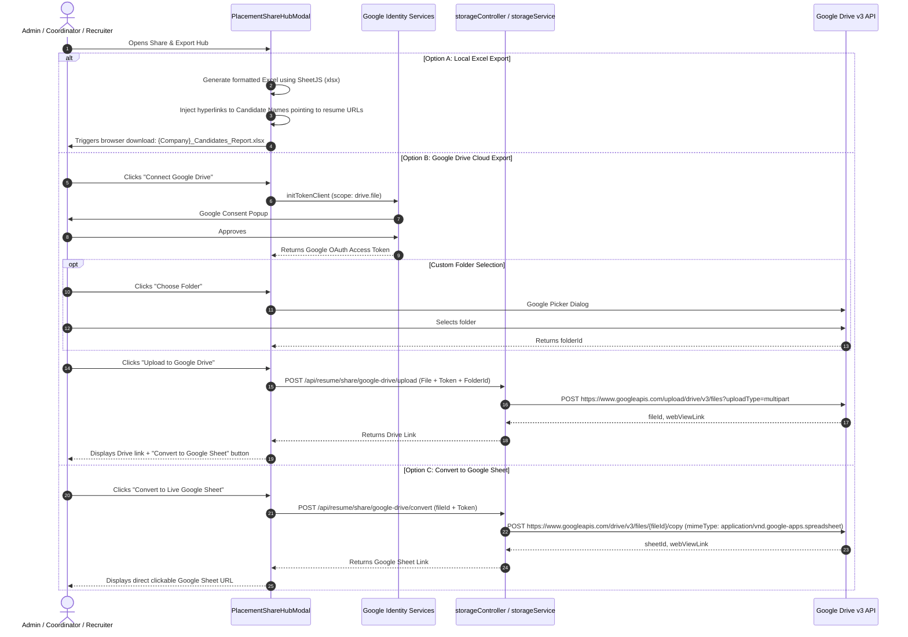

# Comprehensive Study & System Analysis: Student Resume & Recruiter Placement Share Hub

---

## 1. Executive Summary

The **Placement Resume Hub** (Resume Division) in this project is an end-to-end recruitment management and candidate dispatch sub-system. It bridges the gap between internal academic training and external corporate placements by providing:

1. **Student Resume & Profile Management**: Versioned PDF resume uploads (with dual-storage support: Cloudinary + local disk fallback) and comprehensive candidate profiles (skills, academic background, passout year, GitHub, LinkedIn, location).
2. **Internal Placement Operations**: Multi-criteria search and filtering (domain, batch, resume status, date updated), private mentor notes, and multi-student bulk selection.
3. **Dynamic Recruiter Share Catalogs (Resume Collections)**: Packaging selected students into company-specific or domain-specific public share links with customizable job metadata (company name, salary/stipend, job descriptions).
4. **Public Recruiter Portal (Zero-Auth)**: An interactive, branded candidate catalog where HR/recruiters can search, filter, view resumes inline, download standardized renamed PDFs, bulk download ZIP archives, and record live candidate evaluations (`SELECTED`, `UNSELECTED`, `GO TO NEXT ONE`, plus feedback).
5. **Placement Sharing & Cloud Storage Hub**:
   - **Local Excel Report Generation**: Generates structured `.xlsx` files with candidate metadata, evaluation statuses, and **active hyperlinks** pointing directly to candidate resumes.
   - **Google Drive Cloud Integration**: OAuth2-authenticated uploads to Google Drive with folder picking capabilities.
   - **Google Sheets Live Conversion**: Converts static Excel spreadsheets into native interactive Google Sheets in the recruiter's or admin's Google Drive.
6. **Communication Automation**: Integrated WhatsApp messaging engine with placeholder templates and audit logs.

This document presents the complete architectural study, database schema, use cases, API contracts, workflow diagrams, and an extraction guide for rebuilding this division as an independent standalone product or microservice.

---

## 2. High-Level System Architecture



---

## 3. Core Database Entities & Data Modeling

The resume division relies on 5 primary database tables:



### Key Schema Details:
1. **Resume Versioning Mechanism**:
   - `student_resumes.is_latest`: Boolean flag indicating current active resume.
   - When uploading a new resume (`Resume.create`):
     - Sets all existing resumes for `student_id` to `is_latest = FALSE`.
     - Queries `COALESCE(MAX(version), 0) + 1` to assign the incremented version.
     - Inserts new record with `is_latest = TRUE`.
   - On deletion (`Resume.delete`): If deleting the latest resume, it automatically finds the highest remaining version and restores its `is_latest = TRUE`.
2. **Public Data Sanitization**:
   - `resume_notes` are strictly internal (viewed only by authenticated staff/mentors).
   - When fetching public collections by token (`ResumeCollection.getByToken`), internal notes, user passwords, and admin IDs are never queried or returned.

---

## 4. End-to-End Functional Workflows

### 4.1. Student Resume Upload & Storage Fallback



---

### 4.2. Resume Collection Creation & Dynamic Link Generation

1. **Selection**: Coordinator filters students by Domain (e.g. *Full Stack*), Batch, Passout Year, or Status, then checks candidates in `ResumeTable.jsx`.
2. **Action Drawer**: Coordinator clicks **"Generate Share Link"**.
3. **Metadata Modal**: Coordinator inputs:
   - Collection Title (e.g., *Google FullStack Batch 2026*)
   - Company Name (Optional, e.g. *Google India*)
   - Stipend / CTC (Optional, e.g. *14 LPA*)
   - Job Description (Text or Link)
4. **Token Generation**: Controller creates a URL-friendly slug token:
   `generateShareToken(title) -> "google-fullstack-batch-2026-X89AD"`
5. **Persistence**:
   - Inserts into `resume_collections`.
   - Batch inserts mapping records into `resume_collection_students`.
6. **Result**: Generates shareable URL: `/resumes/share/{shareToken}`.

---

### 4.3. Standardized PDF Renaming & Bulk ZIP Archiving

A critical pain point in placements is candidate resumes named generically (`resume.pdf`, `final_cv.pdf`). The system solves this through on-the-fly renaming:

- **Single Download**:
  `GET /api/resumes/download/:studentId` (or public: `GET /api/public/resumes/:token/download/:studentId`)
  - Retrieves student name from DB (e.g., `Jane Doe`).
  - Cleans non-alphanumeric characters: `Jane Doe - Resume.pdf`.
  - Streams file with header:
    `Content-Disposition: attachment; filename="Jane Doe - Resume.pdf"`
- **Bulk ZIP Download**:
  `GET /api/resumes/download-bulk?student_ids=1,2,3`
  - Leverages `JSZip` library in memory.
  - Concurrently fetches Cloudinary URLs or local disk paths.
  - Injects each resume as `[Student Name] - Resume.pdf` into the archive.
  - Returns `Selected_Student_Resumes.zip` or `{CompanyName}_Candidate_Resumes.zip`.

---

### 4.4. Recruiter Portal & Live Evaluation Feedback

When HR opens `https://domain.com/resumes/share/{shareToken}`:
1. **Public Catalog Rendering**:
   - Zero authentication requirement.
   - Shows collection banner (Company, CTC, JD, Candidate count).
   - In-memory candidate search and filter bar (no server hits during filtering).
   - Candidate background preview: College, Passout year, Skills chips, GitHub, and LinkedIn links.
2. **PDF Viewing**:
   - Embeds PDF in an in-browser modal (`ResumeViewer.jsx`) using Cloudinary secure URL or backend stream.
3. **Candidate Evaluation Workflow**:
   - Recruiter clicks **"Evaluate"**.
   - Selects decision status:
     - `PENDING` 🕒
     - `SELECTED` ✅
     - `UNSELECTED` ❌
     - `GO TO NEXT ONE` ➡️
   - Enters detailed evaluation commentary (e.g., *"Strong React foundation, needs work on System Design and DSA trees"*).
   - Submits to `POST /api/public/resumes/:token/review`.
   - Database updates `resume_collection_students` with `review_status`, `review_comment`, and `reviewed_at`.
   - UI status pill instantly updates.

---

### 4.5. Placement Sharing & Cloud Storage Hub (Google Drive & Sheets)

Found in `PlacementShareHubModal.jsx`:



---

### 4.6. Integrated WhatsApp Outreach

1. **Modal**: Triggered for single student or selected candidate batch.
2. **Dynamic Templating**: Pre-configured recruitment message templates:
   - `Resume Shortlisted 🏆`
   - `Interview Scheduled 📅`
   - `Interview Reminder 🔔`
   - `Placement Drive 🚀`
   - `Offer Letter Available 🎉`
3. **Placeholder Replacement**: Automatically injects `{{studentName}}`, `{{companyName}}`, `{{interviewDate}}`, `{{interviewTime}}`, `{{location}}`, `{{coordinatorName}}`.
4. **Phone Normalization**: Strips spaces/dashes, prepends country code `91` if missing.
5. **Execution**: Opens WhatsApp Web / Mobile app via `https://api.whatsapp.com/send?phone=...&text=...`.
6. **Audit Trail**: Logs timestamps, recipient numbers, template IDs, and sender names into `localStorage` (`whatsapp_audit_logs`).

---

## 5. API Reference & Endpoint Specifications

### 5.1. Internal Resume Management Endpoints

| Method | Endpoint | Auth | Description |
|---|---|---|---|
| `POST` | `/api/resumes/upload` | Optional/Bearer | Uploads student resume PDF (max 10MB). Handles versioning and cloud/disk storage. |
| `PUT` | `/api/resumes/:id` | Optional/Bearer | Replaces resume file, incrementing version. |
| `DELETE` | `/api/resumes/:id` | Optional/Bearer | Deletes resume; restores previous version as `is_latest`. |
| `GET` | `/api/resumes` | Optional/Bearer | Fetches all students with latest resume status, batch name, notes, and recruiter reviews. |
| `GET` | `/api/resumes/search` | Optional/Bearer | Searches students by name, email, or mobile. |
| `GET` | `/api/resumes/filter` | Optional/Bearer | Filters by domain, batch, resume status (`has_resume`, `missing`), and date updated. |
| `GET` | `/api/resumes/student/:id` | Optional/Bearer | Gets latest resume record for a student. |
| `GET` | `/api/resumes/history/:studentId` | Optional/Bearer | Gets full version history for a student. |
| `GET` | `/api/resumes/download/:id` | Public/Auth | Downloads resume renamed to `[Student Name] - Resume.pdf`. |
| `GET` | `/api/resumes/download-bulk` | Public/Auth | Downloads ZIP containing selected student resumes (`student_ids=1,2,3`). |
| `PUT` | `/api/resumes/placement/:studentId` | Optional/Bearer | Updates student placement attributes (domain, college, passout year, location, skills, links). |
| `POST` | `/api/resumes/notes` | Optional/Bearer | Adds private mentor note for student. |
| `GET` | `/api/resumes/notes/:studentId` | Optional/Bearer | Gets all private notes for student. |
| `DELETE` | `/api/resumes/notes/:id` | Optional/Bearer | Deletes a private note. |

### 5.2. Resume Collections Endpoints

| Method | Endpoint | Auth | Description |
|---|---|---|---|
| `POST` | `/api/resume-collections` | Optional/Bearer | Creates a new resume collection and associates candidates. Generates share token. |
| `GET` | `/api/resume-collections` | Optional/Bearer | Lists all collections with candidate counts and creator info. |
| `GET` | `/api/resume-collections/:id` | Optional/Bearer | Gets collection details, metadata, and mapped candidates. |
| `PUT` | `/api/resume-collections/:id` | Optional/Bearer | Updates collection metadata (title, company name, salary, JD). |
| `POST` | `/api/resume-collections/:id/students` | Optional/Bearer | Adds candidates to an existing collection link. |
| `DELETE` | `/api/resume-collections/:id/students/:studentId`| Optional/Bearer | Removes candidate from a collection link. |
| `DELETE` | `/api/resume-collections/:id` | Optional/Bearer | Deletes collection and associated mappings. |

### 5.3. Public Recruiter Endpoints (Unauthenticated)

| Method | Endpoint | Auth | Description |
|---|---|---|---|
| `GET` | `/api/public/resumes/:token` | **None** | Fetches public collection details, company info, and candidate list with evaluation reviews. |
| `POST` | `/api/public/resumes/:token/review` | **None** | Recruiter submits evaluation status and comment for a candidate. |
| `GET` | `/api/public/resumes/:token/download/:studentId`| **None** | Recruiter downloads single resume renamed to `[Student Name] - Resume.pdf`. |
| `GET` | `/api/public/resumes/:token/download-bulk` | **None** | Recruiter downloads selected or all candidates in collection bundled in ZIP. |

### 5.4. Cloud Storage & Spreadsheet Integration Endpoints

| Method | Endpoint | Auth / Token | Description |
|---|---|---|---|
| `POST` | `/api/resume/share/google-drive/upload` | Google OAuth Token | Uploads generated Excel buffer to Google Drive (with optional folderId). |
| `POST` | `/api/resume/share/google-drive/convert`| Google OAuth Token | Converts uploaded Excel file in Drive into a native Google Sheet. |

---

## 6. Comprehensive Use Case Matrix

| Use Case ID | Actor | Goal | Pre-condition | Post-condition |
|---|---|---|---|---|
| **UC-01** | Student | Upload resume PDF | Logged in as student | New version stored in Cloudinary/Disk, marked `is_latest = TRUE`. |
| **UC-02** | Student | View upload history | Has uploaded resumes | History timeline displayed showing versions, upload dates, file links. |
| **UC-03** | Coordinator | Filter candidates by Domain & Batch | Logged in as Coordinator/Admin | Real-time candidate list filtered; missing resumes identified. |
| **UC-04** | Coordinator | Add private internal note | Student selected | Note saved with author stamp; hidden from public recruiter view. |
| **UC-05** | Coordinator | Update candidate placement profile | Student profile open | Updated skills, college, passout year, GitHub, LinkedIn. |
| **UC-06** | Coordinator | Bulk export resumes as ZIP | 1 or more candidates selected | Generates ZIP with standardized filenames: `[Name] - Resume.pdf`. |
| **UC-07** | Coordinator | Create recruiter collection link | Candidates selected | Generates unique shareable token and catalog URL. |
| **UC-08** | Coordinator | Modify candidate roster in active link | Collection created | Can append new candidates or drop candidates from link dynamically. |
| **UC-09** | Recruiter | Browse candidate catalog | Has collection URL | Can search skills/colleges, view resume PDFs in browser. |
| **UC-10** | Recruiter | Submit candidate evaluation | Reviewing candidate in catalog | Candidate status updated to `SELECTED` / `UNSELECTED` / `GO TO NEXT ONE` with review comments. |
| **UC-11** | Recruiter / Admin | Export candidate catalog to Excel | Viewing collection | Downloads `.xlsx` with candidate details and clickable resume links. |
| **UC-12** | Recruiter / Admin | Save candidate report to Google Drive | Google Account available | Excel file uploaded directly to chosen Google Drive folder. |
| **UC-13** | Recruiter / Admin | Convert report to native Google Sheet | File uploaded to Drive | Live collaborative Google Sheet created; link displayed. |
| **UC-14** | Coordinator | Send templated WhatsApp notification | Student selected | WhatsApp Web opens with normalized phone number and prefilled message. |

---

## 7. Architecture Blueprint for Extracting into a Standalone Service

If extracting this module into a new standalone product (e.g. **"CandidateHub"** or **"PlacementShare OS"**), follow this architectural blueprint:

### 7.1. Technology Stack Recommendation
- **Backend**: Node.js (Express or NestJS) or Go / Python (FastAPI).
- **Database**: PostgreSQL or MySQL (using Prisma or TypeORM).
- **Blob / File Storage**: AWS S3 or Cloudinary for resume PDFs.
- **Frontend**: React (Vite) or Next.js (App Router).
- **Spreadsheet Generation**: `exceljs` or `xlsx` (SheetJS).
- **Cloud Storage SDKs**: `@googleapis/drive` or REST API with Google Identity Services.

### 7.2. Minimum Data Schema for Standalone Product

```sql
-- 1. Candidates Table
CREATE TABLE candidates (
    id SERIAL PRIMARY KEY,
    name VARCHAR(255) NOT NULL,
    email VARCHAR(255) UNIQUE NOT NULL,
    phone VARCHAR(50),
    domain VARCHAR(100),
    batch VARCHAR(100),
    college VARCHAR(255),
    passout_year INT,
    current_location VARCHAR(100),
    skills TEXT,
    github VARCHAR(255),
    linkedin VARCHAR(255),
    created_at TIMESTAMP DEFAULT CURRENT_TIMESTAMP
);

-- 2. Candidate Resumes (Versioned)
CREATE TABLE candidate_resumes (
    id SERIAL PRIMARY KEY,
    candidate_id INT REFERENCES candidates(id) ON DELETE CASCADE,
    file_name VARCHAR(255) NOT NULL,
    file_url TEXT NOT NULL,
    storage_provider VARCHAR(50) DEFAULT 'cloudinary', -- 'cloudinary', 's3', 'local'
    storage_id VARCHAR(255),
    version INT NOT NULL DEFAULT 1,
    is_latest BOOLEAN DEFAULT TRUE,
    created_at TIMESTAMP DEFAULT CURRENT_TIMESTAMP
);

-- 3. Share Collections
CREATE TABLE share_collections (
    id SERIAL PRIMARY KEY,
    title VARCHAR(255) NOT NULL,
    share_token VARCHAR(100) UNIQUE NOT NULL,
    company_name VARCHAR(255),
    salary VARCHAR(100),
    jd TEXT,
    expires_at TIMESTAMP NULL,
    is_active BOOLEAN DEFAULT TRUE,
    created_at TIMESTAMP DEFAULT CURRENT_TIMESTAMP
);

-- 4. Collection Candidates (Roster + Evaluation)
CREATE TABLE collection_candidates (
    collection_id INT REFERENCES share_collections(id) ON DELETE CASCADE,
    candidate_id INT REFERENCES candidates(id) ON DELETE CASCADE,
    review_status VARCHAR(50) DEFAULT 'pending', -- 'pending', 'selected', 'unselected', 'go_to_next'
    review_comment TEXT,
    reviewed_at TIMESTAMP NULL,
    PRIMARY KEY (collection_id, candidate_id)
);

-- 5. Internal Candidate Notes
CREATE TABLE candidate_notes (
    id SERIAL PRIMARY KEY,
    candidate_id INT REFERENCES candidates(id) ON DELETE CASCADE,
    author_name VARCHAR(100),
    note TEXT NOT NULL,
    created_at TIMESTAMP DEFAULT CURRENT_TIMESTAMP
);
```

### 7.3. Microservice Boundaries & Interfaces
- **Candidate Ingestion Service**: Exposes APIs for students/candidates to sign up, update profiles, and upload PDF resumes.
- **Collection & Link Dispatcher**: Admin interface to create share links, add/remove candidates, manage company metadata, and set expiration timers.
- **Public Portal Gateway**: Serves the unauthenticated recruiter portal, caching candidate lists and rate-limiting review submissions.
- **Export & Storage Bridge**: Microservice handling Excel generation, ZIP bundling with standardized renaming, and cloud integrations (Google Drive / Sheets, OneDrive).
- **Notification Service**: Webhook/REST API sending WhatsApp, SMS, or Email alerts on evaluation status changes.

---

## 8. Summary of Key Strengths & Technical Highlights

1. **Zero-Friction Recruiter Experience**: Recruiters do not need an account or password; they receive an encrypted/slug link that gives them an interactive portal.
2. **Standardized PDF Renaming**: Solves the universal complaint of receiving generic `resume.pdf` files by naming every download `[Candidate Name] - Resume.pdf`.
3. **Dual Cloud & Local Resilience**: Cloudinary uploads automatically fall back to local disk storage if credentials are missing or the API is unreachable.
4. **Interactive Spreadsheet Integration**: Generates Excel files with hyperlinked candidate names that take recruiters directly to online resumes, with seamless 1-click conversion to Google Sheets.
5. **Two-Way Evaluation Feedback**: Recruiters do not just view candidates—they leave structured decisions (`SELECTED`, `UNSELECTED`, `GO TO NEXT ONE`) and detailed feedback directly in the portal.
